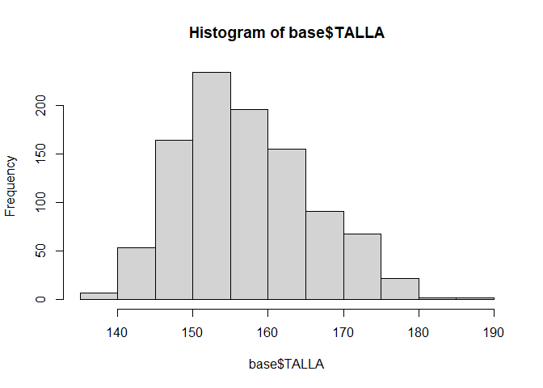
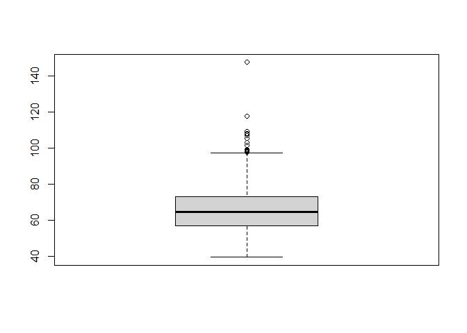
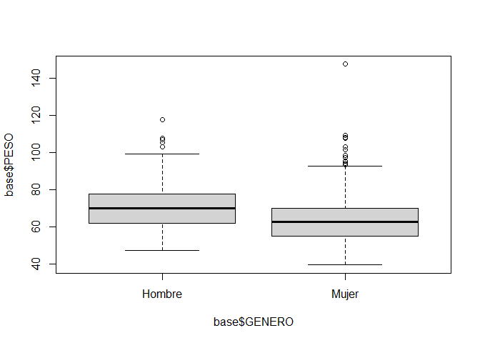
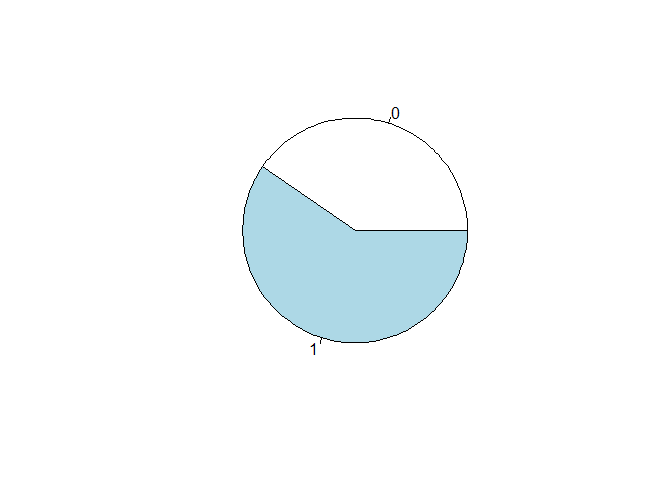
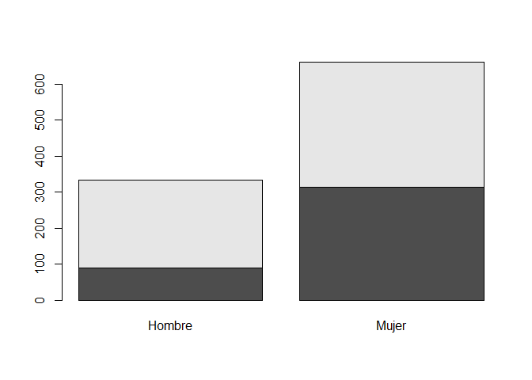
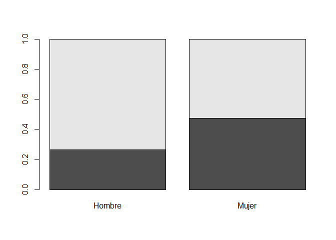
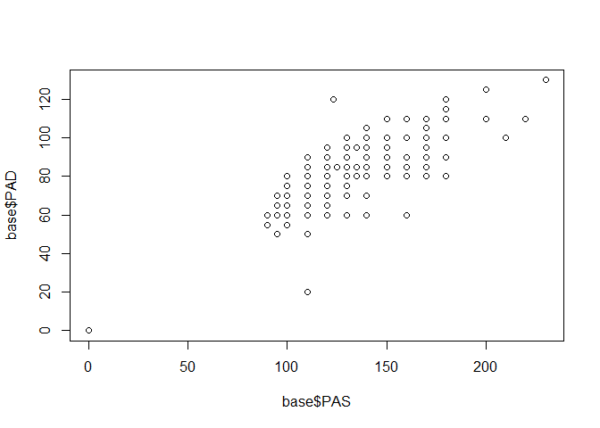

Estadistica Descriptiva
================
C. Lavalle
11-10-2021

**Índice**  
1\. [Instalar librerias](#id1)  
2\. [Cargar libreria](#id2)  
3\. [Cargar bases de datos](#id3)  
4\. [Filtros](#id4)  
5\. [Estadisticos de tendencia central](#id5)  
6\. [Estadisticos de posicion](#id6)  
7\. [Estadisticos de dispersion](#id7)  
8\. [Estadisticos de forma](#id8)  
9\. [Tablas](#id9)  
10\. [Graficos](#id10)

<div id='id1' />

# 1\. Instalar librerias

``` r
install.packages("modeest") # Instala el paquete que permite calcular la moda
install.packages("moments") # Instala el paquete para poder calcular los estadisticos de forma
```

<div id='id2' />

# 2\. Cargar librerias

``` r
library(modeest, quietly = TRUE) # Carga el paquete que permite calcular la moda
library(readxl, quietly = TRUE) # Carga base datos
library(moments, quietly = TRUE) # Carga el paquete para poder calcular los estadisticos de forma
```

<div id='id3' />

# 3\. Cargar bases de datos

``` r
base <- read_excel("Base Litiasis.xls")
head(base)
```

    ## # A tibble: 6 x 17
    ##   IDENT GENERO  EDAD  FUMA DIABETES ULCERA   HTA   PAS   PAD COLTOT TRIGLIC
    ##   <dbl> <chr>  <dbl> <dbl>    <dbl>  <dbl> <dbl> <dbl> <dbl>  <dbl>   <dbl>
    ## 1     1 Hombre    46     1        0      0     0   100    70    180      61
    ## 2     2 Hombre    26     1        0      0     0   110    70    174     113
    ## 3     3 Hombre    25     1        0      0     0   100    60    129      60
    ## 4     4 Hombre    45     1        0      0     0   100    70    265     308
    ## 5     5 Hombre    25     0        0      0     0   130    80    143     100
    ## 6     6 Hombre    49     1        0      0     0   160    90    191      63
    ## # ... with 6 more variables: COLHDL <dbl>, PESO <dbl>, TALLA <dbl>,
    ## #   LITIASIS <chr>, Exam-Enf (litiasis) <chr>, ...17 <chr>

<div id='id4' />

# 4\. Filtros

``` r
fumadores <- base[base$FUMA == 1, ] # Fumadores
head(fumadores)
```

    ## # A tibble: 6 x 17
    ##   IDENT GENERO  EDAD  FUMA DIABETES ULCERA   HTA   PAS   PAD COLTOT TRIGLIC
    ##   <dbl> <chr>  <dbl> <dbl>    <dbl>  <dbl> <dbl> <dbl> <dbl>  <dbl>   <dbl>
    ## 1     1 Hombre    46     1        0      0     0   100    70    180      61
    ## 2     2 Hombre    26     1        0      0     0   110    70    174     113
    ## 3     3 Hombre    25     1        0      0     0   100    60    129      60
    ## 4     4 Hombre    45     1        0      0     0   100    70    265     308
    ## 5     6 Hombre    49     1        0      0     0   160    90    191      63
    ## 6     7 Hombre    43     1        0      0     0   120    70    234      81
    ## # ... with 6 more variables: COLHDL <dbl>, PESO <dbl>, TALLA <dbl>,
    ## #   LITIASIS <chr>, Exam-Enf (litiasis) <chr>, ...17 <chr>

``` r
menores_de_35 <- base[base$EDAD <= 35, ] # Personas menores o iguales a 35 años
head(menores_de_35)
```

    ## # A tibble: 6 x 17
    ##   IDENT GENERO  EDAD  FUMA DIABETES ULCERA   HTA   PAS   PAD COLTOT TRIGLIC
    ##   <dbl> <chr>  <dbl> <dbl>    <dbl>  <dbl> <dbl> <dbl> <dbl>  <dbl>   <dbl>
    ## 1     2 Hombre    26     1        0      0     0   110    70    174     113
    ## 2     3 Hombre    25     1        0      0     0   100    60    129      60
    ## 3     5 Hombre    25     0        0      0     0   130    80    143     100
    ## 4     8 Hombre    20     1        0      0     0   110    70    167     175
    ## 5    11 Hombre    23     0        0      0     0   130    80    167      91
    ## 6    12 Hombre    25     1        0      0     0   120    60    163      48
    ## # ... with 6 more variables: COLHDL <dbl>, PESO <dbl>, TALLA <dbl>,
    ## #   LITIASIS <chr>, Exam-Enf (litiasis) <chr>, ...17 <chr>

``` r
peso_menores_de_35 <- base$PESO[base$EDAD <= 35] # Peso de las personas menores a 35 años
head(peso_menores_de_35)
```

    ## [1] 72.5 58.5 75.0 56.0 77.5 54.0

``` r
peso_menores_de_35 <- base[base$EDAD <= 35,]$PESO # Peso de las personas menores a 35 años
head(peso_menores_de_35)
```

    ## [1] 72.5 58.5 75.0 56.0 77.5 54.0

**Recomendacion**

``` r
base_filtrada <- base[base$FUMA == 1, ] # Primero filtrar la base y guardar como objeto
Peso_fumadores <- base_filtrada$PESO # Luego seleccionar la variable deseada
```

<div id='id5' />

# 5\. Estadisticos de tendencia central

## Media

``` r
mean(base$COLHDL) # Entrega el promedio del colesterol HDL de los pacientes
```

    ## [1] 45.03618

``` r
diabetes <- base[base$DIABETES == 1, ]
mean(diabetes$COLHDL) # Entrega el promedio del colesterol HDL de los pacientes con diabetes
```

    ## [1] 43.5

## Mediana

``` r
median(base$TRIGLIC) # Entrega la mediana de los trigliceridos de los pacientes
```

    ## [1] 104

``` r
pacientes_positivos <- base[base$LITIASIS == "SI", ] # Selecciona solo personas con Litiasis
median(pacientes_positivos$TRIGLIC) # Entrega la mediana de los trigliceridos de los pacientes con litiasis
```

    ## [1] 110

## Moda

``` r
mfv(base$TALLA) # Entrega la (o las) modas de la Talla
```

    ## [1] 153 154 157

<div id='id6' />

# 6\. Estadisticos de posicion

``` r
quantile(base$COLTOT) # Entrega  los cuarteles de la variable colesterol total
```

    ##   0%  25%  50%  75% 100% 
    ##   86  157  182  211  356

``` r
quantile(base$COLHDL, prob=seq(0,1,length=101)) # Entrega todos los percentiles de colesterol total
```

    ##    0%    1%    2%    3%    4%    5%    6%    7%    8%    9%   10%   11%   12% 
    ##  8.00 23.00 25.00 27.00 28.00 29.00 29.00 30.00 30.52 31.00 31.40 32.00 32.28 
    ##   13%   14%   15%   16%   17%   18%   19%   20%   21%   22%   23%   24%   25% 
    ## 33.00 33.00 34.00 34.00 34.00 34.00 35.00 35.00 36.00 36.00 37.00 37.00 37.00 
    ##   26%   27%   28%   29%   30%   31%   32%   33%   34%   35%   36%   37%   38% 
    ## 38.00 38.00 38.00 38.26 39.00 39.00 39.00 39.00 40.00 40.00 40.00 40.00 40.72 
    ##   39%   40%   41%   42%   43%   44%   45%   46%   47%   48%   49%   50%   51% 
    ## 41.00 41.00 41.00 41.00 42.00 42.00 42.00 43.00 43.00 43.00 43.00 43.00 44.00 
    ##   52%   53%   54%   55%   56%   57%   58%   59%   60%   61%   62%   63%   64% 
    ## 44.00 44.00 44.00 45.00 45.00 46.00 46.00 46.00 47.00 47.00 47.00 48.00 48.00 
    ##   65%   66%   67%   68%   69%   70%   71%   72%   73%   74%   75%   76%   77% 
    ## 48.00 48.04 49.00 49.00 50.00 50.00 50.74 51.00 51.00 52.00 52.00 52.00 53.00 
    ##   78%   79%   80%   81%   82%   83%   84%   85%   86%   87%   88%   89%   90% 
    ## 53.00 53.00 54.00 54.00 55.00 55.00 56.00 56.00 57.00 58.00 58.72 59.00 60.00 
    ##   91%   92%   93%   94%   95%   96%   97%   98%   99%  100% 
    ## 61.00 63.00 64.00 65.00 66.00 67.00 69.00 73.00 78.00 99.00

<div id='id7' />

# 7\. Estadisticos de dispersion

## Rango

``` r
range(fumadores$EDAD) # Rango de la edad de los fumadores
```

    ## [1] 19 85

## Rango intercuartil

``` r
edad_fumadores <- fumadores$EDAD # Seleccionar la edad de los fumadores
IQR(edad_fumadores) # RIC de la edad de los fumadores
```

    ## [1] 17

## Desviacion estandar

``` r
sd(diabetes$COLTOT) # Desviacion estandar en el colesterol total de las personas con diabetes
```

    ## [1] 51.41498

## Varianza

``` r
var(diabetes$COLTOT) # Varianza en el colesterol total de las personas con diabetes
```

    ## [1] 2643.5

## Coeficiente de variacion

``` r
(sd(diabetes$COLTOT)/mean(diabetes$COLTOT))*100 # Coeficiente de variacion
```

    ## [1] 23.34392

<div id='id8' />

# 8\. Estadisticos de forma

## Coeficiente de asimetria

``` r
skewness(base$COLHDL) # Coeficiente de asimetria
```

    ## [1] 0.6860253

## Curtosis

``` r
kurtosis(base$COLHDL) # Calcula la curtosis
```

    ## [1] 3.923196

<div id='id9' />

# 9\. Tablas

## Tabla simple

``` r
tabla_ulcera_1 <- table(base$ULCERA) # Crea una tabla de personas con ulceras
tabla_ulcera_1 
```

    ## 
    ##   0   1 
    ## 953  42

## Tabla de doble entrada

``` r
tabla_ulcera_2 <- table(base$ULCERA, base$FUMA) # Personas que fuman y tienen ulceras
tabla_ulcera_2 
```

    ##    
    ##       0   1
    ##   0 381 572
    ##   1  21  21

## Sumas totales

``` r
addmargins(tabla_ulcera_2) # Agrega las sumas totales
```

    ##      
    ##         0   1 Sum
    ##   0   381 572 953
    ##   1    21  21  42
    ##   Sum 402 593 995

``` r
addmargins(tabla_ulcera_2, margin = 1) # Agrega las sumas por COLUMNAS (ULCERA en este caso)
```

    ##      
    ##         0   1
    ##   0   381 572
    ##   1    21  21
    ##   Sum 402 593

``` r
addmargins(tabla_ulcera_2, margin = 2) # Agrega las sumas por FILAS (FUMA en este caso)
```

    ##    
    ##       0   1 Sum
    ##   0 381 572 953
    ##   1  21  21  42

## Tabla de proporciones

``` r
prop.table(tabla_ulcera_2) # Agrega las proporciones totales
```

    ##    
    ##              0          1
    ##   0 0.38291457 0.57487437
    ##   1 0.02110553 0.02110553

``` r
prop.table(tabla_ulcera_2, margin = 1) # Agrega las proporciones por FILAS (FUMA en este caso)
```

    ##    
    ##             0         1
    ##   0 0.3997901 0.6002099
    ##   1 0.5000000 0.5000000

``` r
prop.table(tabla_ulcera_2, margin = 2) # # Agrega las proporciones por COLUMNAS (ULCERA en este caso)
```

    ##    
    ##              0          1
    ##   0 0.94776119 0.96458685
    ##   1 0.05223881 0.03541315

<div id='id10' />

# 10\. Graficos

## Histogramas

``` r
hist(base$TALLA) # Genera el histograma de la Talla
```

<!-- -->

## Grafico de cajas

``` r
boxplot(base$PESO) # Entrega el grafico de caja del peso
```

<!-- -->

``` r
boxplot(base$PESO ~ base$GENERO)# Entrega el grafico de caja del peso por genero
```

<!-- -->

## Grafico circular

``` r
pie(table(base$FUMA)) # Entrega el grafico circular de los fumadores
```

<!-- -->

## Grafico de barras

``` r
barplot(table(base$FUMA,base$GENERO))
```

<!-- -->

## Grafico de barras apilado

``` r
tabla_genero <- table(base$FUMA,base$GENERO)
barplot(prop.table(tabla_genero,margin = 2))
```

<!-- -->

## Graficos de dispercion

``` r
plot(base$PAD ~ base$PAS)
```

<!-- -->
